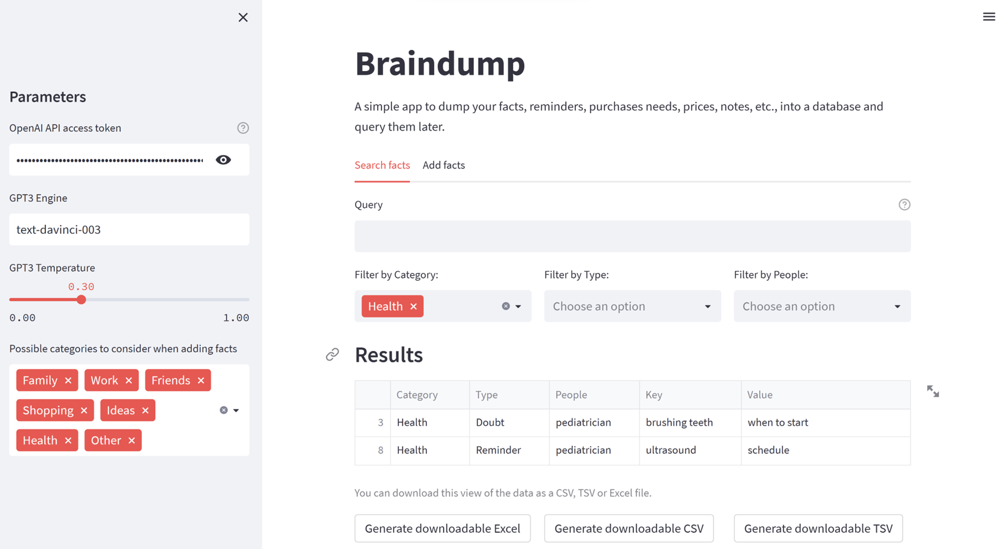
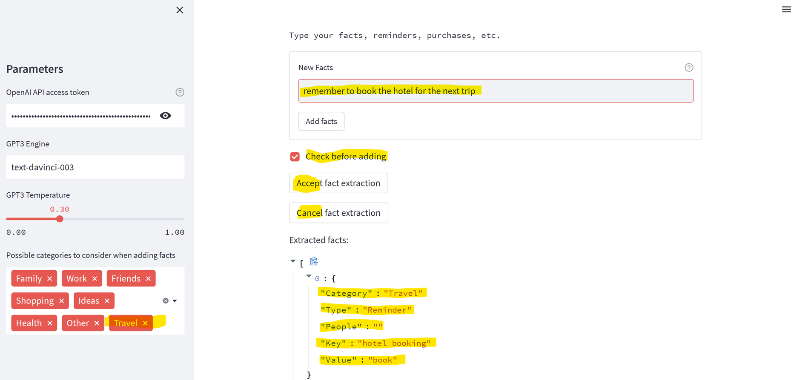

# Braindump
Braindump is a prototype application for taking notes and converting them to a database that can be more easily queried. Just type what is in your mind and the application properly classifies, slices, and stores it for later use. **It was built as a demo to show how to leverage GPT-3 to build applications starting with Proofs-of-Concept, as described in [my Data Science @ Microsoft tutorial, "Building GPT-3 applications — beyond the prompt"](https://medium.com/data-science-at-microsoft/building-gpt-3-applications-beyond-the-prompt-504140835560).** You can use it both to follow the tutorial and as a starting point for your
own studies and applications (e.g., by reusing the utility functions and overal program structures in your own, different, problems).

It is a simple Python application that leverages [Streamlit](https://streamlit.io/) to provide a web interface. To actually call the GPT-3 model, you need to have a working [OpenAI API](https://openai.com/api/) key. At the time of writing, once you create your account, you get some free credits that should be enought to follow the tutorial and get started with the application. The application should also work with the recently released [Azure OpenAI Service](https://azure.microsoft.com/en-us/products/cognitive-services/openai-service/) instead of the original OpenAI offer, though I have not yet tested it there.

Besides the application itself, this repository includes the studies, in the form of Jupyter notebooks, that led to it.

The UI for searching looks like this:

To add facts, the UI is as follows, including an optional manual inspection of the model interpretation:

## Running the Application or Studies

The application has been tested on Python 3.8. The main libraries you'll need are: `openai`, `streamlit`, `pandas`, `notebook`, `pytest`. You can install them manually, or follow the below procedure to create a new environment and install them automatically.

**To run the application:**

  1. It is recommended that you run Python 3.8+, from the Anaconda distribution, which can be obtained [here](https://www.anaconda.com/products/distribution).
  2. To ensure dependencies are properly installed, you can first create a new environment just for this application using `conda create -n braindump_py38 python=3.8`
  3. Activate the new environment using `conda activate braindump_py38`
  4. Install the dependencies listed in `requirements.txt`. You can do this by running `pip install -r requirements.txt` from the root of the project. 
  5. Obtain you need to have a working [OpenAI API](https://openai.com/api/) key and make it available as an environment variable called `OPENAI_API_KEY`.
  6. Finally, launch the application with `run.sh` (on Linux) or `run.bat` (on Windows) from the root of the project.

**To run the studies:**
  1. Follow the steps above, except the last one.
  2. Open the desired Jupyter notebook under `notebooks/` with your favorite Jupyter client (personally, I use VS Code a lot for that).
## Project Structure

The project is structured as follows:
  - `notebooks/`: Jupyter notebooks used for prompt engineering.
  - `src/`: source code for the final application.
  - `data/`: data stored by the application.
  - `tests/`: unit tests for the application.
  - `docs/`: documentation and related assets.

## Approach
The approach is presented in detail in [my Data Science @ Microsoft tutorial, "Building GPT-3 applications — beyond the prompt"](https://medium.com/data-science-at-microsoft/building-gpt-3-applications-beyond-the-prompt-504140835560). Nevertheless, let me highlight some key points here:

  - Large Language Models, notably GPT-3, offer a relatively easy and very flexible way to build some types of software. However, considerable additional Software Engineering aspects are required to actually build a robust and usable application.
  - Proofs-of-Concept (PoC) are great to explore the capabilities of new technologies and demonstrate value quickly and at low cost. They thus provides a way to secure further investents if waranted. Since the application of LLMs like GPT-3 remains a very new area, PoCs are a great way to explore the space and learn.
  - A gradual, iterative, process is the best way to build such PoCs and applications. Start with a simple use case and add features and complexity as you go.
  - In this manner, it is now possible to achieve impressive results with relativelly little effort. Things that would be too costly or even impossible to do previously are now feasible. It is thus a great way to improve productivity -- both for individuals and for organizations. Time to explore and experiment with formerly unthinkable projects!

In terms specific phases, the following is advisable
  - Try the OpenAI Playground with some very simple cases to see if the idea merits more work.
  - Once you decide to proceed, write a simple specification consisting of the basic data structures you'll manipulate and some examples of inputs and outputs.
  - Break the problem in subproblems, and determine which ones can be handled by GPT-3 or similar models.
  - Gradually and iterativelly engineer your prompts, preferably using Jupyter notebooks.
  - Once satisified with the quality of the prompts, encapsulate them and the auxiliary mechanisms in an engine.
  - Build a UI for your engine, preferably with something like  [Streamlit](https://streamlit.io/) or [Gradio](https://www.gradio.app/), both of which produce good results very fast.
  - Show the PoC to stakeholders and iterate as appropriate.

## License

MIT License

Copyright (c) 2023 Paulo Salem da Silva

Permission is hereby granted, free of charge, to any person obtaining a copy
of this software and associated documentation files (the "Software"), to deal
in the Software without restriction, including without limitation the rights
to use, copy, modify, merge, publish, distribute, sublicense, and/or sell
copies of the Software, and to permit persons to whom the Software is
furnished to do so, subject to the following conditions:

The above copyright notice and this permission notice shall be included in all
copies or substantial portions of the Software.

THE SOFTWARE IS PROVIDED "AS IS", WITHOUT WARRANTY OF ANY KIND, EXPRESS OR
IMPLIED, INCLUDING BUT NOT LIMITED TO THE WARRANTIES OF MERCHANTABILITY,
FITNESS FOR A PARTICULAR PURPOSE AND NONINFRINGEMENT. IN NO EVENT SHALL THE
AUTHORS OR COPYRIGHT HOLDERS BE LIABLE FOR ANY CLAIM, DAMAGES OR OTHER
LIABILITY, WHETHER IN AN ACTION OF CONTRACT, TORT OR OTHERWISE, ARISING FROM,
OUT OF OR IN CONNECTION WITH THE SOFTWARE OR THE USE OR OTHER DEALINGS IN THE
SOFTWARE.